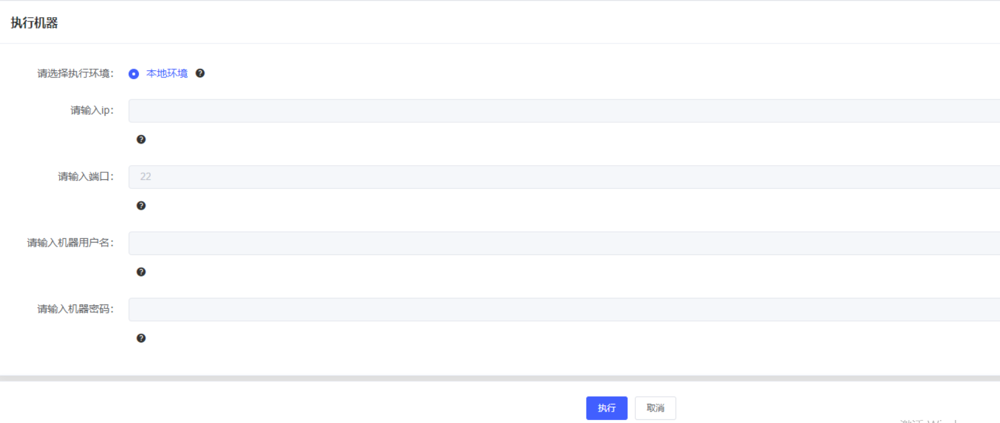

# **介绍**


## Issue
欢迎通过 [新建Issue](https://github.com/vivo/MoonBox/issues/new) 反馈您在月光宝盒使用过程中的**问题**和**建议**。

## 如何贡献

如果你还不知道如何开始的话，可以从这个免费的资料里面找到你想要的内容：[*<u>如何在GitHub上为开源项目做贡献</u>*](https://app.egghead.io/playlists/how-to-contribute-to-an-open-source-project-on-github) 。

## 开发者相关

### 必要前提
请先阅读 [README](./README.md) 文档，了解月光宝盒项目使用的技术和框架。

### 本地调试

#### 代码修改(可选)

若对 moonbox-server 模块内容进行修改，因该模块是标准 web 工程，直接启动即可；

若对 moonbox-agent 模块进行修改，需修改执行后续的打包步骤，方可使修改生效。

#### 脚本打包

- 执行 maven clean install 操作
- 执行 agent 打包脚本 

```shell
# 执行打包命令，命令路径为 /moonbox-agent/moonbox-java-agent/bin
sh ./install-local-agent.sh 
```

打包完成后，会在当前用户根目录生成 sandbox 和 .sandbox-module 文件夹。

#### 任务启动

请在本地运行 moonbox-server 工程，按照 [用户操作手册](./docs/user-guide.md) ，配置录制和回放任务。需要注意的是，本地启动时流量和录制的运行配置，系统会自动判断走本机。如下图：

点击“执行”后，即会把 agent attach 到目标java进程上。

#### 注意事项

需要注意的是，为了能够在本机进行完整的 debug。目标 java 项目（即进程）需要和 moonbox 工程在同一个 IDEA 目录下。如图所示：


我们期待你的参与、反馈和贡献。
