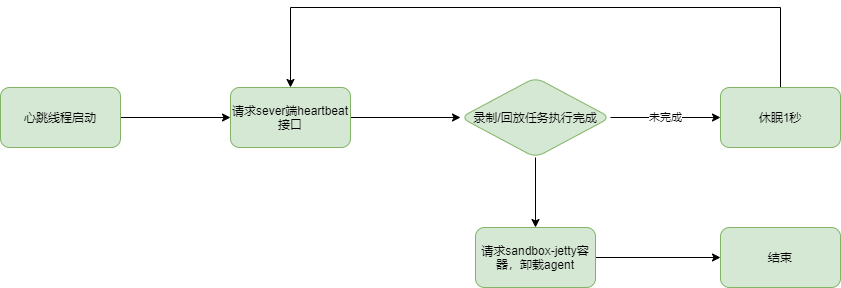
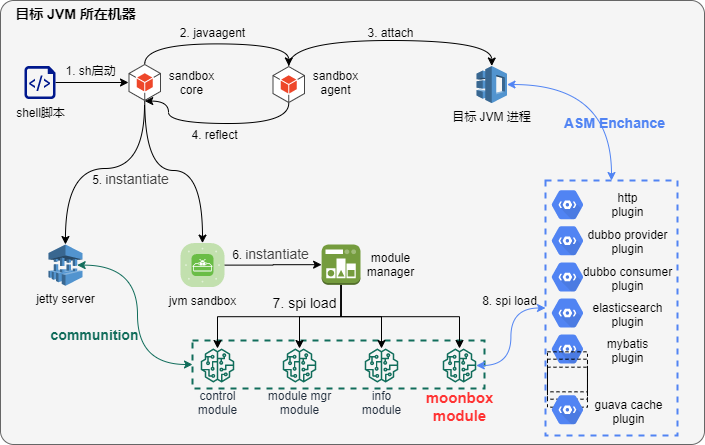
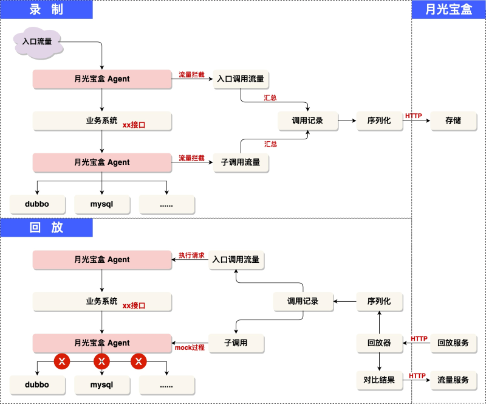

# **Moonbox：月光宝盒**

Moonbox（月光宝盒）是[JVM-Sandbox](https://github.com/alibaba/jvm-sandbox-repeater)生态下的，基于[jvm-sandbox-repeater](https://github.com/alibaba/jvm-sandbox-repeater)重新开发的，一款流量回放平台产品。相较于jvm-sandbox-repeater，Moonbox功能更加丰富、数据可靠性更高，同时便于快速线上部署和使用，[更多对比参考](./docs/repeater-diff.md)。

## 使用场景

> 你是否遇到过以下的问题？
>
> - 线上有个用户请求一直不成功，我想在测试环境Debug一下，能帮我复现一下吗？
> - 压测流量不知道怎么构造，数据结构太复杂，压测模型也难以评估，有什么好的办法吗？
> - 不想写接口测试脚本了，我想做一个流量录制系统，把线上用户场景做业务回归，可能会接入很多服务系统，不想让每个系统都进行改造，有好的框架选择吗？
> - 我想做一个业务监控系统，对线上核心接口采样之后做一些业务校验，实时监控业务正确性


Moonbox（月光宝盒）是一个**无侵入**的线上**流量录制** 和**流量回放**平台，沿用了jvm-sandbox-repeater的SPI设计，并提供了大量的常用插件，同时也提供数据统计和存储能力。通过Moonbox可以实现自动化测试、线上问题追踪、和业务监控等能力


###  名词解释

- **录制**：把一次请求的入参、出参、**下游RPC、DB、缓存**等序列化并存储的过程
- **回放**：把录制数据还原，重新发起一次或N次请求，对特定的下游节点进行MOCK的过程
- **入口调用**：入口调用一般是应用的**流量来源**，比如http/dubbo，在调用过程中录制调用入参，返回值。回放时作为流量发起和执行结果对比依据
- **子调用**：区别于入口调用，子调用是调用执行过程中某次方法调用。子调用在录制时会记录该方法的入参、返回值；回放时用该返回值进行MOCK
- **MOCK**：在回放时，被拦截的子调用**不会发生真实调用**，利用字节码动态干预能力，将录制时的返回值直接返回
- **降噪**：在回放时，部分回放子调用入参或者回放流量响应结果和原始流量对比不一致字段，对这些非必要字段进行排除对比过程

### 功能介绍

- 流量录制：流量录制模板管理，录制任务下发和录制流量查看
- 流量回放：流量回放任务管理，回放数据查看成功率统计
- 回放mock：流量录制和回放特殊mock（作为子调用mock）
- 对比配置：流量回放字段忽略配置

更多详细功能介绍，详见 [Moonbox操作手册](./docs/user-guide.md)

## 技术原理
### 系统架构图
月光宝盒平台分为2个部分，分别为moonbox-agent 和 moonbox-server

**moonbox-agent**

- 使用java-attach技术(实际的动态字节码增强由JVM-Sandbox实现)动态代理到目标进程上，提供流量录制和回放的增强

**moonbox-server**

- agent端使用接口，提供配置查询、录制流量保存、流量查询、回放结果保存等服务
- 录制任务/回放任务的配置，agent任务远程管理能力和管理后台操作界面(前后端分离部署)


### 系统流程图

#### 流量录制


流量录制的路径为【管理后台-流量录制】，此图描述了大致的流程。其中左侧为月光宝盒后台执行，右侧部分为目标JVM机器执行部分

#### 流量回放


流量回放的路径有两个：【管理后台-流量录制-录制任务-流量回放】和【流量回放-失败回放/重新回放】。

sandbox-agent和moonbo-agent的下载流程，和上一节 *流量录制*  部分相同

#### 心跳请求



流量录制和回放任务启动时，会同时启动心跳线程，通过对此心跳线程 管理目标JVM上装载的 agent。当录制任务和回放任务执行完毕(或状态异常)时，agent上心跳线程调用sandbox-jetty容器接口，进行sandbox和moonbox的agent卸载操作，此过程不影响目标JVM正常功能

#### agent加载


本图描述了Sandbox agent和Moonbox agent 启动的流程，包括 目标java进程attach操作，jetty服务启动和流量回放插件加载示意

### 核心原理

#### 录制回放原理

录制和回放流程沿用 jvm-sandbox-repeater设计，舍弃了一些非主流程功能。

**流量录制** 核心逻辑录制协议基于JVM-Sandbox的`BEFORE`、`RETRUN`、`THROW`事件机制进行录制流程控制，详见[DefaultEventListener](./moonbox-agent/moonbox-java-agent/moonbox-core/src/main/java/com/alibaba/jvm/sandbox/repeater/plugin/core/impl/api/DefaultEventListener.java)

**流量回放** 基于 [FlowDispather](./moonbox-agent/moonbox-java-agent/moonbox-api/src/main/java/com/alibaba/jvm/sandbox/repeater/plugin/api/FlowDispatcher.java) 
进行回放流量分发，每个类型回放插件实现[Repeater](./moonbox-agent/moonbox-java-agent/moonbox-api/src/main/java/com/alibaba/jvm/sandbox/repeater/plugin/spi/Repeater.java)SPI完成回放请求发起；每次回放请求可决定本地回放是否mock，插件也自由实现mock逻辑，mock流程代码

> mock回放：回放流量子调用（eg:mybatis/dubbo)不发生真实调用，从录制子调用中根据 [MockStrategy](./moonbox-agent/moonbox-java-agent/moonbox-api/src/main/java/com/alibaba/jvm/sandbox/repeater/plugin/spi/MockStrategy.java) 
> 搜索匹配的子调用，利用JVM-Sandbox的流程干预能力，有匹配结果，进行`throwReturnImmediately`返回，没有匹配结果则抛出异常阻断流程，避免重复调用污染数据

#### 示意图




## 快速开始

### Moonbox平台部署

#### 资源准备

| 资源类型          | 资源版本          | 说明                                                                        |
|---------------|---------------|---------------------------------------------------------------------------|
| jdk           | 1.8           | 工程使用jdk版本                                                                 |
| mysql         | 5.x           | 存储配置数据[建表语句参考](./db/mysql)                                                |
| elasticsearch | 7.x（推荐7.16.2） | 存储录制和回放 json数据 ([es安装文档参考](https://developer.aliyun.com/article/1054281)) |
| 虚拟机/容器        | 无             | 2台分别部署moonbox-server和VUE前端资源(server和vue也可以部署在一台机器)                        |

#### 工程下载
月光宝盒是标准的maven工程，因此机器环境需要安装 java 和 maven 并配置好环境变量。
直接从代码仓下载代码到本地，在根目录执行 mvn clean install操作。执行maven工程的打包构建。

代码结构说明如下：


#### server部署

Moonbox-server是标准的spring-boot工程，只需要按照spring-boot方式启动部署即可。部署前，需要修Moonbox/Moonbox-server/Moonbox-web/src/main/resource/application.properties 中配置

```php
#mysql
spring.datasource.url=mysql链接地址
spring.datasource.username=mysql数据库名称
spring.datasource.password=mysql数据库密码
#es
config.elasticsearch.nodes=es集群http地址
#其他
moonbox.server.url=moonbox-server所部属机器的ip/域名,方便后续和agent交互
```

#### 前端部署

1、修改[vue.config.js](./client/vue.config.js)文件中服务器地址，具体为
```js
module.exports.devServer.proxy."/api".target="moonbox-server所部属机器的ip/域名"
```
2、安装nodejs及配置环境变量，可打开下方链接参考（*nodejs版本建议安装12.10.0，版本过高会导致node-sass安装出现问题*，如果出现权限问题，windows以管理员方式执行cmd执行命令，nodejs 12.10.0安装路径:https://nodejs.org/download/release/v12.10.0/）

[win安装参考](https://zhuanlan.zhihu.com/p/86241466?utm_source=wechat_session)

[mac安装参考](https://blog.csdn.net/m0_67402588/article/details/126075205)

2、打开cmd或者powershell，cd至client目录

3、npm install

4、npm run dev

### 系统操作

流量的录制和回放可以在Moonbox管理台上可视化操作，操作详情请见
[Moonbox操作手册](./docs/user-guide.md)

### 关于java进程

moonbox-java-agent 使用 **transmittable-thread-local** (简称ttl)进行跨线程录制回放，因此需要目标java进程使用ttl线程池或ttl runnable接口。

若目标java代码未使用ttl线程池，可以用java agent方式，在目标java进程启动时添加额外增强

```
-javaagent:D:\repository\com\alibaba\transmittable-thread-local\2.10.2\transmittable-thread-local-2.10.2.jar
```

更多请参见[使用`Java Agent`来修饰`JDK`线程池实现类](https://github.com/alibaba/transmittable-thread-local/blob/master/README.md#23-%E4%BD%BF%E7%94%A8java-agent%E6%9D%A5%E4%BF%AE%E9%A5%B0jdk%E7%BA%BF%E7%A8%8B%E6%B1%A0%E5%AE%9E%E7%8E%B0%E7%B1%BB))

## 未来计划

月光宝盒项目已经在vivo运行2年，接入了上百个项目。内部有较多新特性正在开发和使用中，预计会陆续会对外开源，包括

- 丰富更多的插件
- mysql的数据存储
- 基于c++的流量录制回放
- docker化平台部署
- 用例、场景管理能力
- 定时录制、回放能力

## 微信交流群


